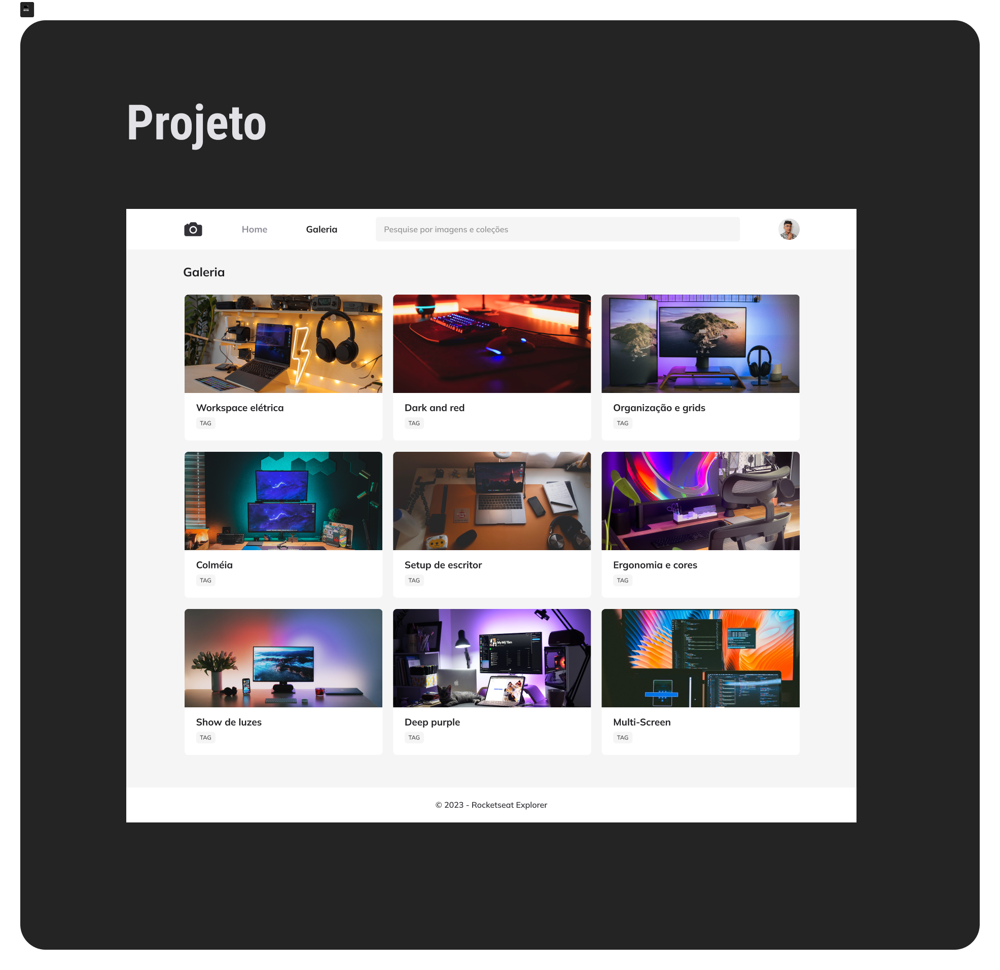

<h1 align="center"> Galeria </h1>

Nesse desafio, você deverá recriar uma aplicação, a partir de um layout, para treinar o que aprendeu até agora no Stage 03, mais especificamente, as técnicas sobre Grid e CSS animation.  

## 🚀 Tecnologias

Esse projeto foi desenvolvido com as seguintes tecnologias:

- HTML e CSS
- JavaScript
- Git e Github
- Figma

## 💻 Projeto

Galeria de fotos

## 🔖 Layout

Você pode visualizar o layout do projeto através [DESSE LINK] (https://www.figma.com/file/pcsFlBZ6hSW2UY5W1mtDVS/Fotoblog-%E2%80%A2-Projeto-Explorer-(Community)?type=design&node-id=437-182&mode=design&t=lWVBYDe0tgZc8X1b-0). É necessário ter conta no [Figma] (https://figma.com) para acessá-lo.

## :memo: Licença

Esse projeto está sob a licença MIT.

---

Feito com ♥ by Rocketseat :wave: [Participe da nossa comunidade!] (https://discord.gg/rocketseat)

---

Esse projeto foi realizado pela aluna Kássia Almeida Moura em 2024.
# Projeto-07

